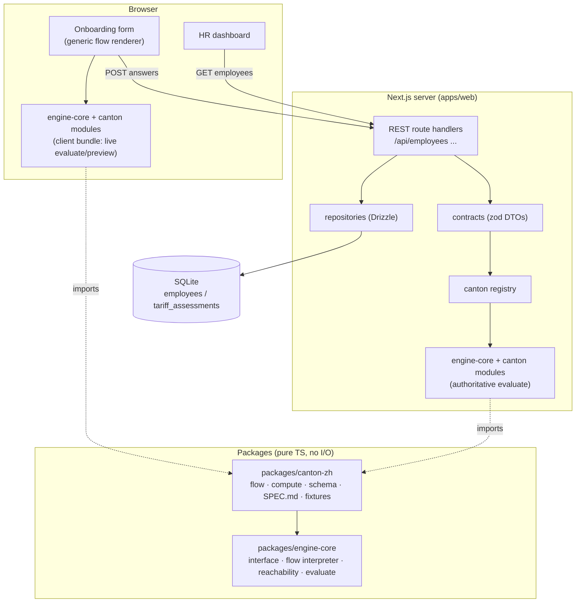
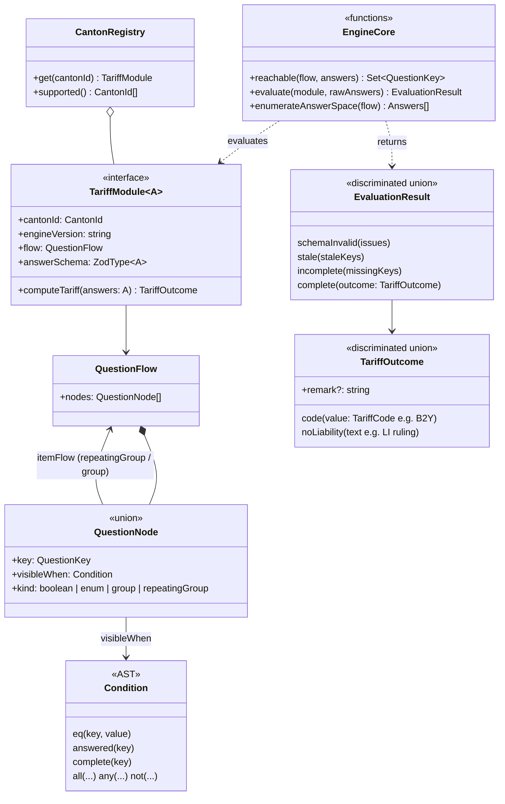
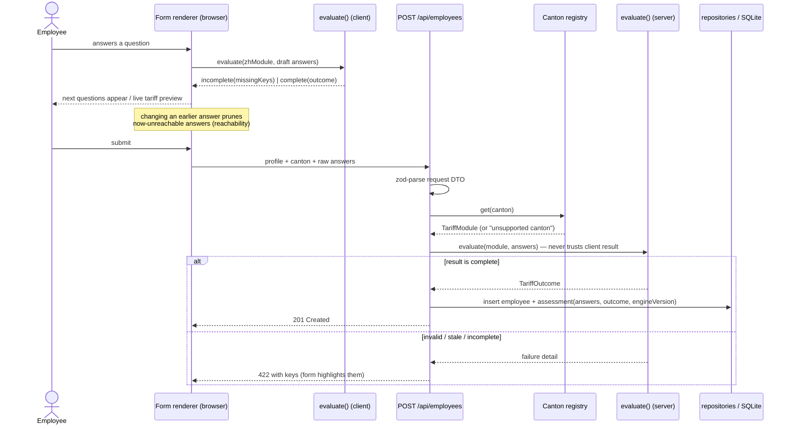
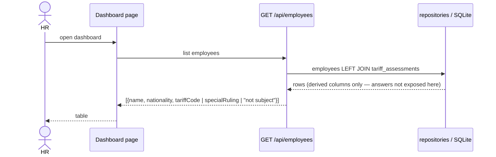
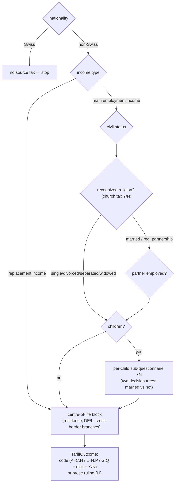

# Architecture Overview — Swiss Source-Tax Tariff Platform (PoC)

This document is the entry point to the design. It describes the system at the level
of components, contracts, and flows; each significant decision has its own ADR with
context and alternatives.

**The system in one paragraph:** a full-stack TypeScript monorepo where the Zurich
source-tax calculator's logic lives as a pure, isomorphic *canton module* (declarative
question flow + typed compute function) behind a canton-agnostic interface. A generic
form renderer interprets any canton's flow to drive the employee onboarding form; a
Next.js backend re-evaluates answers authoritatively and persists them as a versioned
document with derived tariff columns; the HR dashboard reads those columns. AI agents
build and maintain canton modules through a spec-centric pipeline whose regression
contract is an exhaustive behavioral snapshot.

## Decision index

| ADR | Decision |
|---|---|
| [adr-monorepo-single-nextjs-app](adr-monorepo-single-nextjs-app.md) | pnpm monorepo; one Next.js app; pure domain packages; REST route handlers |
| [adr-canton-plugin-architecture](adr-canton-plugin-architecture.md) | Cantons are self-contained plugin modules behind one interface + registry |
| [adr-declarative-flow-typed-compute](adr-declarative-flow-typed-compute.md) | Question flow is data; tariff computation is typed TS; stale-answer guard derived from reachability |
| [adr-answers-as-versioned-document](adr-answers-as-versioned-document.md) | Raw answers stored as JSON document + engine version; derived result columns |
| [adr-sqlite-drizzle-for-poc](adr-sqlite-drizzle-for-poc.md) | SQLite + Drizzle for clone-and-run; Postgres migration path |
| [adr-spec-centric-ai-pipeline](adr-spec-centric-ai-pipeline.md) | Specialized agents in a pipeline; loops only when bounded and oracle-closed |
| [adr-exhaustive-behavioral-snapshot](adr-exhaustive-behavioral-snapshot.md) | Enumerate the full answer space; committed snapshot is the regression contract |

Companion documents: [database-design](database-design.md) ·
[ai-development-workflow](ai-development-workflow.md) ·
[testing-strategy](testing-strategy.md) · [security-and-safety](security-and-safety.md)

## Requirements shaping the design

From `guideline.md` and the domain extraction (`extraction_reference/EXTRACTION-NOTES.md`):

1. One tariff function used by **both** the onboarding form and the HR dashboard →
   the engine must be pure and isomorphic (browser + Node).
2. Conditional question flow with non-trivial semantics: nested sub-questionnaires
   (per child, centre-of-life), two distinct decision trees keyed on marital status,
   outcomes that are sometimes prose rulings instead of codes, and a stale-answer
   invalidation guard.
3. Future cantons and future compliance processes → shared code must be
   canton-generic; adding a canton must not touch shared code.
4. Government sources change silently → maintenance (re-extraction, behavioral
   diffing, recomputation) is a first-class workflow, not an afterthought.
5. AI agents produce most code → the architecture must give them narrow workspaces,
   machine-checkable contracts, and deterministic verification.

## System components



Dependency rule (enforced by package boundaries): `engine-core` knows no canton;
canton packages know only `engine-core`; only `apps/web` assembles the registry and
touches I/O.

## Repository layout

```
/
├─ CLAUDE.md                    # project constitution for AI agents
├─ guideline.md
├─ README.md                    # (deliverable) approach, AI workflow, trade-offs
├─ docs/                        # this document, ADRs, design docs
├─ tasks/                       # todo.md, lessons.md (agent self-improvement loop)
├─ extraction_reference/        # raw ZH reverse-engineering evidence (input, never imported)
├─ .claude/
│  ├─ agents/                   # extractor, implementer, verifier, security-reviewer
│  ├─ commands|skills/          # /extract-canton, /implement-canton, /update-canton, ...
│  └─ settings.json             # permission guardrails
├─ apps/
│  └─ web/                      # the Next.js app
│     ├─ src/app/               #   UI routes: onboarding, dashboard
│     ├─ src/app/api/           #   REST route handlers (the Node backend)
│     ├─ src/components/        #   flow renderer + question-kind components
│     └─ src/server/            #   server-only: repositories, services, db schema
└─ packages/
   ├─ engine-core/              # interface, condition AST, reachability, evaluate, enumerator
   └─ canton-zh/
      ├─ CLAUDE.md              # canton-local agent context
      ├─ SPEC.md                # normative rule spec (human-approved contract)
      ├─ fixtures/              # vendor examples + curated golden cases
      └─ src/                   # flow.ts, compute.ts, schema.ts, index.ts
```

The "frontend folder / backend folder" intuition maps to `src/app` + `src/components`
(frontend) vs `src/app/api` + `src/server` (backend) inside the one Next.js app, with
the domain logic deliberately in neither — see
[adr-monorepo-single-nextjs-app](adr-monorepo-single-nextjs-app.md).

## Domain model (software design)



Key semantics:

- **`evaluate` is the single entry point** used by the form (live, per keystroke) and
  the server (authoritatively, on submit). Its pipeline: zod parse → stale check
  (`answeredKeys ⊆ reachable(flow, answers)`) → completeness (reachable keys all
  answered) → `computeTariff`. The `incomplete.missingKeys` result is what the form
  renderer uses to decide which questions to show next — form behavior and engine
  semantics cannot drift because they are the same computation.
- **`repeatingGroup`** models Zurich's per-child sub-questionnaires (each child is an
  instance of an item flow); **`group`** models the centre-of-life block. Both nest
  ordinary `QuestionFlow`s, so reachability and completeness recurse naturally.
- **`TariffOutcome` is a union**, because the source calculator can return a prose
  ruling (Liechtenstein) that overrides the letter-digit-letter code — encoding this
  in types prevents the classic bug of assuming every result matches `^[A-Z]\d[YN]$`.

## Runtime flows

### Onboarding submission (the authoritative path)



Swiss employees short-circuit before any of this: nationality `CH` means no
questionnaire and no assessment row — a rule of the *platform*, not of any canton.

### HR dashboard



The dashboard reads **stored derived columns** — it never recomputes. Results change
only through an explicit, versioned recompute pass (see the rule-change playbook in
[ai-development-workflow](ai-development-workflow.md)); in a compliance product a
historical result silently changing on page load would be a bug, not freshness.

## The Zurich flow, compressed

Full normative detail belongs to `packages/canton-zh/SPEC.md` (built from
`extraction_reference/EXTRACTION-NOTES.md`); this sketch shows the shape the generic
renderer must handle:



## API surface (PoC)

| Endpoint | Purpose |
|---|---|
| `POST /api/employees` | Create employee (+ evaluate & persist assessment when non-Swiss) |
| `GET /api/employees` | Dashboard listing with derived tariff columns |
| `GET /api/employees/:id` | Detail (profile + assessment incl. answers) — supports review UX |

Request/response DTOs are zod schemas in a module shared by client and server, so the
form's fetch layer and the route handlers are typed against the same contract.

## Cross-cutting choices

- **Versioning**: each canton module exports `engineVersion`; it is stamped on every
  stored assessment. The flow definition and SPEC.md carry the same version. This is
  the hinge for auditability and for the recompute workflow.
- **i18n**: question labels live in the flow definition as message keys with a
  default language (English for the PoC; the source is German — labels are data, so
  adding languages later touches no logic). Documented trade-off: PoC renders one
  language.
- **Error handling**: engine failures are values (`EvaluationResult` union), never
  exceptions; route handlers map them to 4xx with structured detail. Exceptions are
  reserved for genuine bugs and become 500s with no internals leaked.
- **No drafts**: the PoC persists only complete submissions (simplest correct thing);
  draft persistence would reuse the same evaluation pipeline later.
- **No auth in PoC**: documented, deliberate scope cut with a designed seam — see
  [security-and-safety](security-and-safety.md).

## How the architecture absorbs the known futures

| Future event | What changes | What doesn't |
|---|---|---|
| New canton | new `packages/canton-xx` (spec, flow, compute, fixtures) + 1 registry line | renderer, API, DB schema, dashboard, engine-core |
| Zurich rules change | `canton-zh` spec/flow/compute + snapshot diff + recompute pass | everything outside `canton-zh` |
| New process type (family allowances) | interface gains `processType`; registry keyed by (process, canton); assessments gain `process_type` column; new process packages | renderer (flows are flows), evaluation pipeline, storage pattern |
| Scale/production | SQLite→Postgres (driver swap), auth middleware, append-only determination history | domain packages, contracts, UI |

The first two rows are the subject of dedicated, codified AI playbooks — see
[ai-development-workflow](ai-development-workflow.md).
