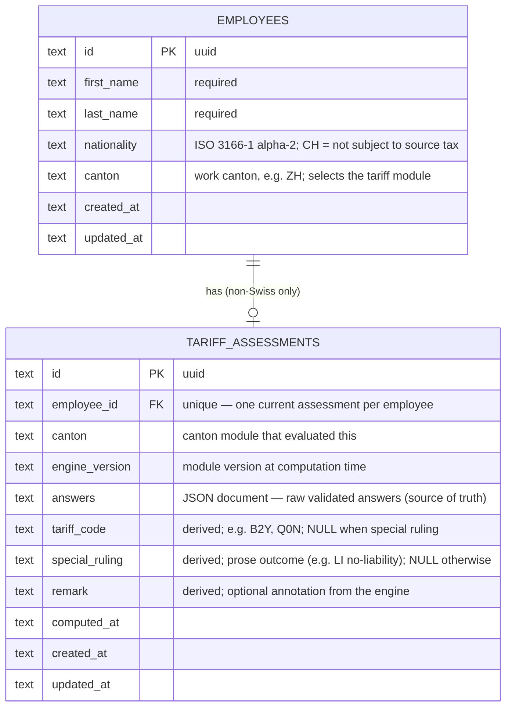

# Database Design

Decisions behind this schema: [adr-answers-as-versioned-document](adr-answers-as-versioned-document.md)
(document + derived columns) and [adr-sqlite-drizzle-for-poc](adr-sqlite-drizzle-for-poc.md)
(SQLite + Drizzle, Postgres path).

## Design forces

1. **Per-canton heterogeneity** — every canton asks different questions; the schema
   must be canton-invariant or every new canton becomes a migration.
2. **Answers are the source of truth** — tariff codes are derived and must be
   recomputable when engines change; the reverse direction is impossible.
3. **Auditability** — a compliance product must be able to say *which* engine version
   produced *this* code from *these* answers, and result changes must be explicit
   events, never side effects.
4. **Clone-and-run** — zero-setup local database for reviewers.

## Entity–relationship model



(Column types shown as SQLite storage classes; timestamps ISO-8601 text. In the
Drizzle schema these are typed columns with the JSON column typed as the canton
answer union at the boundary, not `any`.)

## Semantics and invariants

- **Swiss employees have no assessment row.** "Not subject to source tax" is the
  *absence* of an assessment, presented by the dashboard — not a magic tariff value.
- **Exactly one of `tariff_code` / `special_ruling` is non-null** on every row — the
  stored image of the `TariffOutcome` union. (Enforced by a CHECK constraint and by
  construction in the repository layer.)
- **Write path**: a row is inserted only when server-side `evaluate` returned
  `complete`. `answers`, the derived columns, and `engine_version` are written in the
  same transaction as the employee row — derived columns are always consistent with
  `answers` under `engine_version`.
- **`answers` is immutable** once written. A re-submission (employee redoes the form)
  replaces the assessment (upsert on `employee_id`) with a fresh evaluation; a
  *recompute* rewrites only derived columns + `engine_version` + `computed_at`, from
  the stored answers.
- **Recompute pass** (runs when a canton module's `engineVersion` bumps): select
  assessments where `canton = X and engine_version < current`, re-run `evaluate` on
  stored `answers`, update derived columns, and emit a report of rows whose outcome
  changed (HR-facing signal) or whose answers no longer validate against the new
  schema (employee-must-re-onboard signal — a product workflow, deliberately not
  auto-resolved).

## What the dashboard queries

One indexed join, no JSON access on the hot path:

```
employees LEFT JOIN tariff_assessments ON employee_id
→ name, nationality, tariff_code | special_ruling | (no row → "not subject")
```

The `answers` document is read only on the detail view and by the recompute pass.
This is the payoff of "document for input, typed columns for output": per-canton
flexibility on the write side, uniform relational queries on the read side.

## Evolution path (documented, not built)

| Need | Change |
|---|---|
| Production DB | Postgres via Drizzle dialect swap; `answers` becomes `jsonb`; same repositories |
| Multiple processes per employee (family allowances) | drop the unique constraint to (employee_id, process_type); add `process_type` to assessments; registry keyed by (process, canton) |
| Full audit trail | append-only `determinations` history table (assessment_id, engine_version, outcome, computed_at); current table keeps the head |
| Reinterpreting old answers after flow changes | versioned flow definitions retained per `engine_version` (the git history already holds them; a `flow_versions` table operationalizes it) |
| Answer-level analytics | projection table or generated columns fed from `answers` — without changing the source of truth |
| Multi-tenancy | `tenant_id` on both tables + row-level security (Postgres) |

None of these require changing how today's data is written — which is the test the
PoC schema was designed against.
